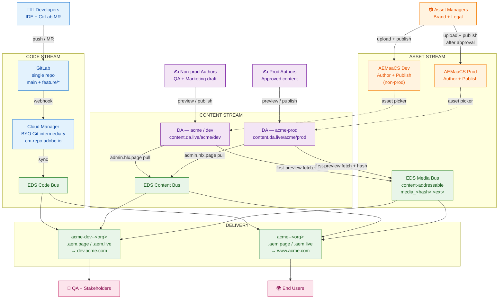
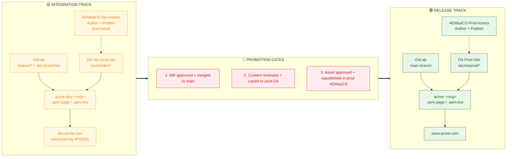
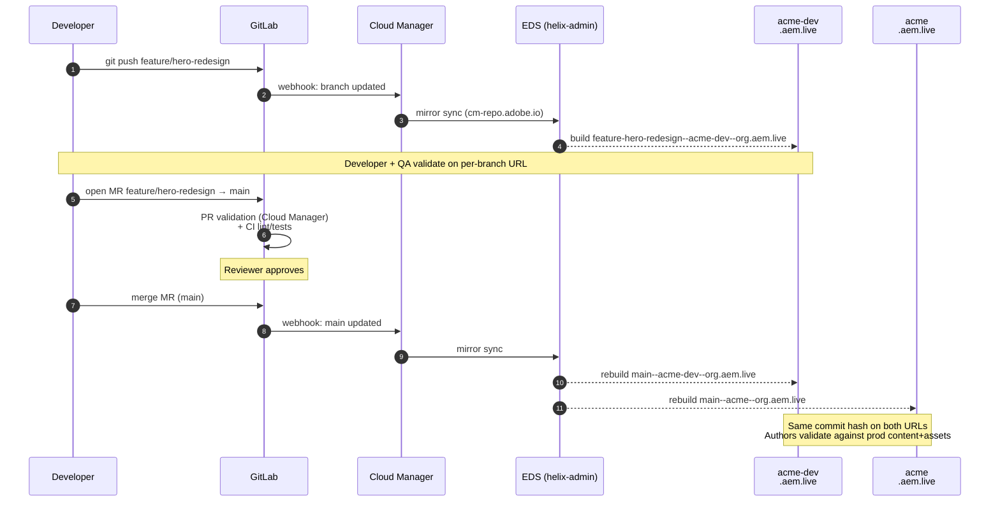
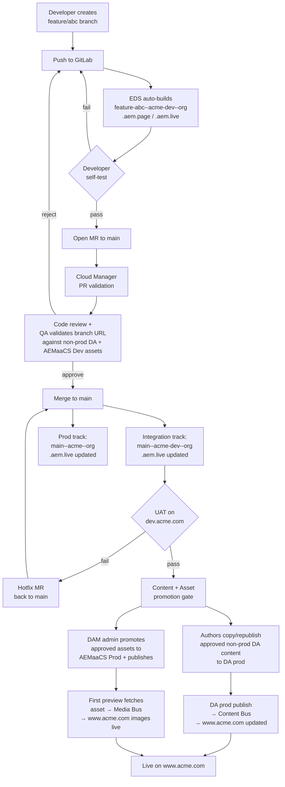

# AEM Edge Delivery Services — Multi‑Environment Architecture & Release Strategy

> **Scope:** A reference architecture for a customer running Adobe Experience Manager Edge Delivery Services (EDS) with three coordinated lifecycles — **Code**, **Content**, and **Assets** — across two parallel tracks (Integration and Release). Code is shipped from **GitLab via Cloud Manager's Bring‑Your‑Own‑Git (BYO Git)** integration. Content is authored in **Document Authoring (`da.live`)**. Assets are stored in **AEM as a Cloud Service Assets** without Dynamic Media.

---

## Table of Contents

1. [Executive Summary](#1-executive-summary)
2. [Foundational Concepts](#2-foundational-concepts)
3. [The Three Lifecycle Streams](#3-the-three-lifecycle-streams)
4. [Multi‑Environment Architecture](#4-multienvironment-architecture)
5. [Architecture Diagrams](#5-architecture-diagrams)
6. [Personas & Environment Ownership](#6-personas--environment-ownership)
7. [Branching & Release Workflow](#7-branching--release-workflow)
8. [Asset Delivery & Caching Best Practices](#8-asset-delivery--caching-best-practices)
9. [Operational Governance](#9-operational-governance)
10. [Appendix — Configuration Snippets](#10-appendix--configuration-snippets)

---

## 1. Executive Summary

EDS is a fundamentally different delivery platform from classic AEM Sites + Dispatcher. Its architecture is built around three independent buses — **Code Bus**, **Content Bus**, and **Media Bus** — each with its own lifecycle, its own caching model, and its own promotion path. A successful multi‑environment design starts by aligning your release process to *those* lifecycles rather than forcing a monolithic dev→QA→prod promotion onto them.

The recommended architecture for this customer is a **two‑track topology**:

| Track | Purpose | Code | Content | Assets |
|---|---|---|---|---|
| **Integration Track** | Non‑prod playground for development, content drafting, asset experimentation, QA, and stakeholder review. | GitLab feature & `dev` branches → preview/live URLs on `*.aem.page` / `*.aem.live` (integration EDS site, e.g. `acme-dev`). | DA org/site dedicated to non‑prod (e.g. `acme` / `dev` — `content.da.live/acme/dev`). | AEMaaCS **Dev** environment (non‑production DAM — not the AEMaaCS Stage runtime). |
| **Release Track** | Production. Content and assets are governed; only validated code reaches `main`. | GitLab `main` branch → production EDS site → custom domain. | DA org/site dedicated to prod (e.g., `acme`). | AEMaaCS **production** program. |

Within each track, EDS gives every Git branch its own preview (`*.aem.page`) and live (`*.aem.live`) URL — so within the Integration Track alone you effectively get unlimited per‑developer testing environments, eliminating the need for a separate dedicated integration CDN in most cases.

The high‑value engineering work in this design is **wiring the EDS site configurations correctly** so that the right code branch, the right DA content store, and the right AEM Assets origin all flow into the right published URL — automatically, with strong governance, and with surgical cache invalidation.

---

## 2. Foundational Concepts

Before discussing environments, three foundational concepts from the aem.live architecture must be internalized. Most environment design mistakes for EDS come from skipping these.

### 2.1 "Branch = Environment" — the aem.live philosophy

Per the [aem.live staging guide](https://www.aem.live/docs/staging), EDS gives every active Git branch a complete, isolated preview and live URL:

```
https://<branch>--<repo>--<owner>.aem.page    ← preview (low cache, immediate)
https://<branch>--<repo>--<owner>.aem.live    ← live (high cache, CDN-friendly)
```

This means a feature branch named `feature/hero-redesign` automatically gets:
- `feature-hero-redesign--acme-eds--mycompany.aem.page`
- `feature-hero-redesign--acme-eds--mycompany.aem.live`

A traditional shared "dev environment" — where one broken commit blocks the whole team — is **not needed** in EDS. Each branch *is* its own environment.

### 2.2 `*.aem.page` is **not** a staging environment

`*.aem.page` and `*.aem.live` use **different caching rules**. `aem.page` is optimized for authoring immediacy (low TTL, fast invalidation), while `aem.live` is optimized for cacheability. Using `aem.page` as a stand‑in for production delivery (`aem.live`) will give you false confidence — a page that performs well on `aem.page` may behave differently on `aem.live`. Always validate code against the `*.aem.live` URL of a branch, not the `*.aem.page` URL.

### 2.3 Why the two‑track model is still necessary

EDS's branch‑per‑environment model handles **code** elegantly, but content and assets are **not** branchable in the same way:

- **DA content** lives in DA's storage (`content.da.live`) under a single org/site path. There is no "branch" of a DA document.
- **AEMaaCS Assets** are binary objects in a stateful repository. Authors edit them in place; there is no asset branch.

A single shared content store and a single shared DAM means that an experimental content change or a draft asset would immediately leak into production previews. **The customer's request for two DAMs and two DAs is exactly the right answer** — it gives content authors and asset managers their own isolated playground that mirrors the code‑side branch isolation EDS already provides.

### 2.4 Three buses, three lifecycles

| Bus | Source of Truth | Lifecycle | Promotion Mechanism |
|---|---|---|---|
| **Code Bus** | GitLab repo (mirrored via Cloud Manager BYO Git) | Per‑branch; `main` is production | Git PR merge → Cloud Manager webhook → mirror → EDS sync |
| **Content Bus** | DA org/site (`content.da.live`) | Document‑level preview/publish | Author clicks Preview / Publish in DA Sidekick |
| **Media Bus** | Hash‑addressed copy of every asset referenced from a previewed document | Content‑addressable; immutable per hash | Asset is fetched and hashed when the document referencing it is previewed |

Understanding that **Media Bus is content‑addressable** is critical: every asset is stored once under a unique hash (`media_<hash>.<ext>`). When the same image is referenced from twenty pages, it is stored once. When the source asset is replaced in AEM Assets, EDS sees a different hash and stores a *new* object — the old URL stays valid until no document references it.

---

## 3. The Three Lifecycle Streams

### 3.1 Code — GitLab → Cloud Manager BYO Git → EDS Code Bus

EDS's native code source is GitHub via the AEM Code Sync app. For organizations that cannot use GitHub, Adobe provides **Bring Your Own Git (BYO Git)** through Cloud Manager. The currently supported vendors include **GitLab** (Cloud and self‑hosted), Bitbucket, GitHub Enterprise, and Azure DevOps.

The BYO Git flow:

1. The customer's GitLab repo is **registered in Cloud Manager** (Programs → Repositories → Add Repository, type: GitLab).
2. A **webhook** is configured on the GitLab repo pointing to Cloud Manager's webhook URL, with a generated webhook secret.
3. The EDS site is configured to use the registered repo via the Admin API:
   ```
   POST https://admin.hlx.page/config/<org>/sites/<site>/code.json
   {
     "source": {
       "url": "https://cm-repo.adobe.io/api",
       "raw_url": "https://cm-repo.adobe.io/api/raw",
       "owner": "<program-id>",
       "repo": "<repository-id>",
       "type": "byogit",
       "secretId": "cm-byog"
     }
   }
   ```
4. On every push to any branch, the GitLab webhook → Cloud Manager → EDS Code Bus pipeline fires automatically. EDS recompiles per‑branch preview/live URLs.

Because Cloud Manager is the intermediary, the customer can keep their canonical source in GitLab (with all of its CI, MR review, and SAST controls intact) while EDS sees a stable Adobe‑hosted mirror.

### 3.2 Content — Document Authoring (`da.live`) → EDS Content Bus

DA is a SaaS product hosted at `da.live` with content storage at `content.da.live`. Authors create and edit HTML documents in a WYSIWYG interface. Each DA "site" (under an "org") has:

- A document tree (`/{org}/{site}/...`).
- A `.da/config` sheet (DA‑side: permissions, library, AEM Assets connector keys).
- A connection to an EDS site (via `fstab.yaml` in the code repo, mountpoint pointing at `https://content.da.live/{org}/{site}`).

Two **separate DA sites** (or two separate DA orgs, depending on identity boundary needs) give the customer two truly isolated content stores — one per track.

A crucial nuance: DA's preview/publish actions hit EDS's Admin API (`admin.hlx.page`), which **pulls** content from `content.da.live` into the Content Bus. The `*.aem.page` URL serves preview content; the `*.aem.live` URL serves published content. This means content promotion is orthogonal to code promotion — a content author can preview a draft against an old code release or a new feature branch, just by changing the URL prefix.

### 3.3 Assets — AEMaaCS Assets (no Dynamic Media) → EDS Media Bus

This is the most nuanced piece for this customer because Dynamic Media is **not** in scope. The flow is:

1. Asset uploaded to **AEMaaCS Author** (under `/content/dam/...`).
2. Asset replicated to **AEMaaCS Publish** via standard AEM publish workflow. **The asset must be published** for DA / EDS to consume it (DA's AEM Assets integration explicitly requires this — without DM, the publish tier is the delivery origin).
3. In DA's editor, the author opens the **AEM Assets browser** (image icon in the toolbar) and selects the asset. DA inserts the asset's AEM publish‑tier delivery URL into the document.
4. When the DA document is **previewed** for the first time, EDS:
   - Fetches the asset from the AEM publish tier.
   - Hashes the binary content.
   - Stores it in **Media Bus** under `media_<hash>.<ext>`.
   - Rewrites the document's reference to point to the Media Bus URL.
5. From that moment on, the asset is served from the EDS CDN — never again hitting AEMaaCS Publish for that hash.

The Media Bus then performs **on‑the‑fly format conversion** (AVIF for supporting browsers, WebP fallback, original as last resort) and **responsive resizing** based on the `?width=...&format=...&optimize=...` query parameters automatically generated by EDS. This is what gives EDS sites their characteristic Lighthouse‑100 image performance — without ever touching Dynamic Media.

> **Without Dynamic Media, you do not get features like Smart Crop, image presets, or URL‑based transformations from AEM.** All optimization is handled by EDS's Media Bus, which is sufficient for the vast majority of marketing imagery (responsive sizing + modern format delivery).

---

## 4. Multi‑Environment Architecture

### 4.1 Environment Matrix (the canonical view)

| Concern | Integration Track (non‑prod) | Release Track (production) |
|---|---|---|
| **GitLab branches in scope** | `feature/*`, `dev`, `release/*` | `main` |
| **Cloud Manager BYO Git registration** | Single registration shared across both tracks | Same registration |
| **EDS site (helix‑admin org/site)** | `acme-dev` | `acme` |
| **EDS preview URL pattern** | `<branch>--acme-dev--<org>.aem.page` | `main--acme--<org>.aem.page` |
| **EDS live URL pattern** | `<branch>--acme-dev--<org>.aem.live` | `main--acme--<org>.aem.live` |
| **Public hostname** | `dev.acme.com` (BYO CDN or Adobe Managed CDN) | `www.acme.com` |
| **DA content store** | `https://da.live/#/acme/dev` | `https://da.live/#/acme/prod` |
| **`fstab.yaml` mountpoint** | `https://content.da.live/acme/dev` | `https://content.da.live/acme/prod` |
| **AEMaaCS Assets program** | Non‑prod program, **Dev** environment | Production program |
| **DA → AEM Assets config keys** | Dev program ID, Dev publish hostname (AEMaaCS Dev tier) | Prod program ID, prod publish hostname |
| **Push invalidation target** | Integration track CDN / Adobe Managed CDN (non‑prod edge) | Prod CDN |

### 4.2 Why a *single* GitLab repository with two EDS sites

The customer should run **one GitLab repository** that drives **two EDS sites** (`acme-dev` and `acme`). The repo is registered once in Cloud Manager via BYO Git, and that single registration is referenced by both EDS site configurations.

This is the same pattern as the EDS "Repoless" feature: multiple sites share a code source. From the [BYO Git docs](https://www.aem.live/developer/byo-git):

> *"If you want to use the same code across multiple sites, you can leverage the Repoless feature in Edge Delivery Services, which is fully compatible with any external Git repository... reuse the same `<program-id>` and `<repository-id>` as in the first site."*

**Why this is better than two repos:**

- A code change validated on the Integration Track is *byte‑identical* on the Release Track — no merge drift, no "but it worked on **dev**" debugging.
- Branch isolation is still complete: `feature/x` only exists on the Integration Track's preview URLs because the Release Track's site config typically only reacts to `main`. (You can scope this via Admin API config or by simply not exposing non‑main branches on the prod hostname.)
- Cloud Manager only has one repository to manage and authenticate against.

### 4.3 Why two AEMaaCS programs (non‑prod Dev vs prod) is non‑negotiable

Unlike code branches (cheap and unlimited), AEM as a Cloud Service environments are heavyweight and stateful. The customer's existing AEMaaCS Assets license likely already includes:

- A **non‑production program** with a **Dev** environment used as the integration‑track DAM (this reference architecture wires DA on the integration track to **AEMaaCS Dev**, not to a separate AEMaaCS **Stage** environment).
- A **production program** with author + publish.

These should map directly to the two tracks. Authors uploading new asset variants, testing rendition pipelines, or experimenting with metadata schemas should never do this on the production AEM Author. Asset reviewers (rights & legal) gate the *promotion* of an asset from **AEMaaCS Dev** to prod.

> **Promotion of assets** between AEMaaCS programs is **not automatic**. Teams typically use AEM Assets Migration tooling, asset workflows, or — more commonly for a smaller, curated asset set — manually re‑upload approved assets to the production program. The two‑track model accepts this duplication as the cost of governance.

### 4.4 Why two DA sites (or two DA orgs)

DA permissions are configured per org via `https://da.live/config#/{org}/`, and content lives at `https://content.da.live/{org}/{site}/`. Two options exist:

- **Two sites under one org** (`acme/dev` and `acme/prod`) — simpler IMS group management; permissions applied per path.
- **Two separate orgs** (`acme-dev` and `acme`) — strongest isolation; useful when authoring teams should have zero visibility into the other track.

For most customers, **two sites under one org** with strict path‑level permissions in the org's permissions sheet is the right balance. A `reviewers` group might have `read` on non‑prod paths and nothing on prod; a `prod-publishers` group has `write` on prod paths only.

---

## 5. Architecture Diagrams

### 5.1 High‑Level Architecture — All three streams converging on EDS



### 5.2 Two‑Track Topology — Side‑by‑Side



### 5.3 Branching & Release Workflow (Code)



### 5.4 Asset Delivery Flow (no Dynamic Media)

```mermaid
flowchart LR
    classDef src fill:#fff3e0,stroke:#e65100
    classDef proc fill:#e8eaf6,stroke:#1a237e
    classDef edge fill:#e8f5e9,stroke:#1b5e20
    classDef user fill:#fce4ec,stroke:#880e4f

    UP["Asset uploaded to<br/>AEMaaCS Author<br/>/content/dam/hero.jpg"]:::src
    PUB["Replicated to<br/>AEMaaCS Publish<br/>(must be published)"]:::src
    DA["Author selects asset<br/>via DA Assets browser<br/>→ inserts publish URL"]:::proc
    PREV["Author clicks Preview<br/>in DA"]:::proc
    FETCH["EDS fetches asset<br/>from AEMaaCS Publish<br/>(one-time, per hash)"]:::proc
    HASH["EDS hashes binary<br/>→ media_a3f9...c2.jpg"]:::proc
    MB["Stored in<br/>EDS Media Bus<br/>(immutable per hash)"]:::edge
    REWRITE["Document HTML<br/>references rewritten<br/>to media_*.jpg"]:::proc
    CDN["CDN edge<br/>(Adobe Managed or BYO)<br/>+ on-the-fly<br/>AVIF/WebP/resize"]:::edge
    BR["Browser receives<br/>WebP/AVIF<br/>at correct DPR & width"]:::user

    UP --> PUB
    PUB --> DA
    DA --> PREV
    PREV --> FETCH
    FETCH --> HASH
    HASH --> MB
    MB --> REWRITE
    REWRITE --> CDN
    CDN --> BR

    style FETCH stroke-dasharray: 5 5
```



> **Key insight from the diagram:** AEMaaCS Publish is hit **only once per asset hash**. Once cached in Media Bus, the asset is served from the EDS edge for every subsequent request. This is what makes the no‑Dynamic‑Media path performant: AEMaaCS is the *origin of authority*, not the *origin of delivery*.

---

## 6. Personas & Environment Ownership

| Environment | Primary Users | Their Activities | URL Pattern |
|---|---|---|---|
| **Per‑branch preview** (`<branch>--acme-dev--<org>.aem.page`) | Developers | Live‑edit feedback, smoke testing of code+content+asset combinations. | `feature-x--acme-dev--<org>.aem.page` |
| **Per‑branch live** (`<branch>--acme-dev--<org>.aem.live`) | Developers, QA | Test under production cache rules (TTLs, push invalidation). | `feature-x--acme-dev--<org>.aem.live` |
| **Integration Track public** (`dev.acme.com`) | QA, Marketing reviewers, internal stakeholders, third‑party reviewers (legal, brand) | End‑to‑end UAT against `main` branch + non‑prod DA content + **AEMaaCS Dev** DAM assets. SSO/IP‑gated. | `dev.acme.com` (proxies to `main--acme-dev--<org>.aem.live`) |
| **DA — integration / non‑prod** (`da.live/#/acme/dev`) | Content authors (drafting), marketing teams, content QA | Author drafts, run preview, validate layout against **AEMaaCS Dev** assets. | DA UI |
| **DA Prod** (`da.live/#/acme/prod`) | Content publishers (small group), localization leads | Final publish to production. Drafts copied from non‑prod DA after content QA. | DA UI |
| **AEMaaCS Dev (non‑prod DAM)** | Asset managers (test ingest), brand/legal (review), photographers (upload drafts) | Upload, metadata enrichment, rendition testing, rights review — **AEMaaCS Dev** tier. | Dev Author URL from Cloud Manager |
| **AEMaaCS Prod Assets** | Asset publishers (small group), DAM admins | Final upload, publish to publish tier. | `author.adobeaemcloud.com` |
| **Release Track production** (`www.acme.com`) | End users, search engines, analytics | Live site. | `www.acme.com` (proxies to `main--acme--<org>.aem.live`) |

### 6.1 RACI summary

| Activity | Developer | Content Author | Asset Manager | QA | DAM Admin | Release Mgr |
|---|---|---|---|---|---|---|
| Code commit & MR | **R** | I | I | C | I | I |
| Code review approval | **A** | — | — | C | — | I |
| Merge to `main` | R | — | — | — | — | **A** |
| Authoring on non‑prod DA | I | **R** | C | C | — | I |
| Promote DA content to prod | C | C | — | C | — | **A** |
| Asset upload (non‑prod) | — | I | **R** | C | C | — |
| Asset approval | — | I | C | — | **A** | I |
| Promote asset to prod | — | I | C | — | **R** | A |
| Production deployment validation | C | C | C | **R** | — | A |
| Push invalidation / cache flush | C | I | I | C | — | **A** |

---

## 7. Branching & Release Workflow

### 7.1 GitLab branch strategy

A **trunk‑based** flow with short‑lived feature branches is the natural fit for EDS, because EDS already publishes every branch automatically.

```
main                ← protected; deploys to BOTH acme-dev and acme EDS sites
└── feature/*       ← short-lived; deploys to acme-dev only (per-branch URLs)
└── hotfix/*        ← short-lived; expedited path through main
```

> Avoid a long‑lived `develop` or `staging` branch. The aem.live staging guide is explicit on this: *"creating a separate `staging` branch and mapping this to a separate CDN site is not advisable."* A branch per feature is what the system is optimized for.

**Branch protection on `main` (GitLab):**

- Require an approved Merge Request before merging.
- Require Cloud Manager PR validation status check to pass.
- Require the branch to be up‑to‑date with `main` before merge.
- No direct pushes to `main`.

### 7.2 The end‑to‑end release flow



### 7.3 Release cadence and gates

| Gate | Owner | Criteria |
|---|---|---|
| **Code → Integration track** | Developer | Branch builds clean, lint passes, branch URL renders |
| **Code → `main`** | Tech Lead + Cloud Manager PR validation | MR approved, CI green, QA sign‑off on branch URL |
| **Code in production** | Release Manager | UAT on `dev.acme.com` passes, no Sev1 open |
| **Content → Prod DA** | Content Lead | Editorial review, legal sign‑off, asset references resolve |
| **Asset → Prod DAM** | DAM Admin | Rights cleared, metadata complete, rendition QC done |
| **Domain switch / cache purge** | Release Manager | All three streams aligned on production track |

### 7.4 Hotfix path

```
hotfix/<ticket> ← branched from main, NOT from feature
    ↓
push → branch URL on integration track
    ↓
expedited MR review (single approver, fast-track CI)
    ↓
merge to main
    ↓
auto-deploy to both tracks; verify on www.acme.com
```

Hotfixes deliberately bypass the long integration‑hostname UAT gate (`dev.acme.com`). The integration track is still updated automatically (because it tracks `main`), but the release manager can choose to deploy to prod immediately for Sev1 fixes.

---

## 8. Asset Delivery & Caching Best Practices

This section is specifically tailored to the **AEMaaCS Assets without Dynamic Media** scenario.

### 8.1 Treat the AEMaaCS publish tier as an origin, not a delivery surface

The AEM publish tier should be **invisible to end users**. All public traffic goes to the EDS CDN; the only fetches against AEM Publish are the one‑time asset ingestion fetches by EDS Media Bus.

**Implications:**

- Don't burn engineering effort tuning AEM Dispatcher caching rules for public traffic — that traffic doesn't reach Dispatcher.
- Do ensure the AEM publish tier responds quickly to Media Bus's one‑time fetches: keep AEM `/content/dam` paths simple, with appropriate Dispatcher cache rules to hold renditions for the AEM publish replication interval.
- Restrict Dispatcher access from the public internet for `/content/dam/...` if your security model allows; only allow Adobe IP ranges. (Consult Adobe Support for the appropriate Media Bus egress IP range.)

### 8.2 Use AEM's Web‑Optimized Image Delivery as the *origin* format

Even without Dynamic Media, AEMaaCS provides the **Web‑Optimized Image Delivery** service for assets under `/content/dam`. This service generates renditions automatically and serves WebP at delivery time. While EDS Media Bus will re‑optimize the image after fetch, having WebP at the origin reduces:

- The bytes pulled across the wire on first preview.
- The cold‑start latency for previews of high‑volume image pages.

Enable it at the AEMaaCS image component level (design dialog → Enable Web Optimized Images) for any AEM Sites templates the customer is still maintaining. For pure EDS sites, the relevant URL is constructed by DA's AEM Assets connector.

### 8.3 Asset hash stability — the #1 operational rule

EDS Media Bus is **content‑addressable**: the URL contains a hash of the binary. This means:

- ✅ **Re‑uploading the same bytes** under any name → same hash → same URL → no cache impact, no purge needed.
- ⚠️ **Uploading a modified version** under the same path in AEM → different hash → new URL is minted on next preview → **all referencing pages must be re‑previewed for the new URL to flow through**.

**Operational practice:**

After replacing an asset in AEMaaCS Prod:

1. Republish the asset in AEM (so the publish tier serves the new bytes).
2. In DA, use the asset's publish URL in the search to find every page referencing it.
3. Bulk‑preview all those pages (DA's bulk preview tool).
4. QA the previews — visual diff, layout, alt text.
5. Bulk‑publish.

This is documented in the [DA AEM Assets setup guide](https://docs.da.live/administrators/guides/setup-aem-assets) and is the standard "image refresh" workflow. Skipping the bulk re‑preview step is the most common cause of "we updated the image but production still shows the old one" tickets.

### 8.4 Push invalidation across the CDN tier

When DA publishes a document, EDS surgically purges the Adobe Managed CDN. If the customer is using a **BYO CDN** in front (e.g., Akamai, Fastly, Cloudflare, CloudFront), they should configure **push invalidation** so the upstream CDN is also purged on each publish event.

Configuration is per‑site in the EDS site configuration; see [aem.live's CDN setup docs](https://www.aem.live/docs/cdn-guide). The push invalidation contract:

- EDS publishes a document → EDS purges its own edge → EDS pushes invalidation events to the customer CDN's API → the customer CDN purges by URL.
- Same flow on asset hash changes (rare, by design).

For the **Integration Track**, the customer can typically use the Adobe Managed CDN directly without push invalidation complexity. Push invalidation should be configured for the **Release Track BYO CDN** if one is in use.

### 8.5 Cache hierarchy — what lives where, for how long

| Layer | What's cached | TTL behavior | Invalidation trigger |
|---|---|---|---|
| Browser | Everything with proper headers | Per `Cache-Control` (long for `media_*` hashed URLs, short for HTML) | Hash change for media; document republish for HTML |
| BYO CDN edge (if used) | HTML + media + JS/CSS | Long for hashed assets; short for HTML | Push invalidation on publish |
| Adobe Managed CDN | HTML + media + JS/CSS | Same | Automatic on publish |
| EDS Media Bus | Binary asset blobs | Effectively immutable per hash | Never (new hash = new entry) |
| EDS Content Bus | Document HTML (preview/published states) | Bound to preview/publish lifecycle | Author preview/publish action |
| EDS Code Bus | JS/CSS/templates | Per Git commit | Push to branch |

### 8.6 DA → AEM Assets configuration

The DA‑side configuration that wires DA to a specific AEMaaCS environment is set per DA site (or org) in the DA config sheet. Per the [DA AEM Assets setup docs](https://docs.da.live/administrators/guides/setup-aem-assets), the relevant keys include the AEM environment hostname and the IMS client ID. **Critically, the customer must configure two distinct sets of keys** — one in the non‑prod DA site config (pointing to **AEMaaCS Dev**) and one in the DA prod site config (pointing to AEMaaCS Prod). This is what enables the two‑track separation at the asset stream level.

> **Watch out:** It is tempting to point both DA sites at the production AEMaaCS to "save the duplication." Don't. An author drafting on non‑prod DA will then see — and could insert — un‑approved or rights‑pending assets, and the whole point of the separation is lost.

---

## 9. Operational Governance

### 9.1 Permissions matrix

| Role | GitLab | DA (non‑prod) | DA Prod | AEMaaCS Dev | AEMaaCS Prod |
|---|---|---|---|---|---|
| Developer | Maintainer (own MRs) | Read | Read | Author tester (Dev) | Read‑only on author |
| Content Author | None | Write | Read | None | None |
| Content Publisher | None | Write | Write | None | None |
| Asset Manager | None | Read | Read | Write (DAM, Dev) | Read‑only |
| DAM Admin | None | Read | Read | Admin (Dev) | Admin |
| QA Engineer | Reporter | Read | Read | Read‑only | Read‑only |
| Release Manager | Maintainer (protected branches) | Read | Write | Read‑only | Read‑only |

Configure DA permissions via the org permissions sheet at `https://da.live/config#/<org>/`. Configure AEMaaCS permissions via Admin Console product profiles. Configure GitLab via project member roles + protected branch rules.

### 9.2 Push validation for code

Enable [Cloud Manager push validation](https://www.aem.live/docs/) for the EDS site so that bad code changes are rejected at the MR/push stage rather than discovered at preview time. This includes:

- Code quality checks (SonarQube via Cloud Manager).
- Lighthouse score threshold checks (the EDS opinionated default is "performance must not regress").
- Sidekick / boilerplate compatibility checks.

### 9.3 Observability

| Stream | What to monitor | Where |
|---|---|---|
| Code | Cloud Manager pipeline status, EDS sync events | Cloud Manager UI; GitLab webhooks log |
| Content | DA preview/publish events, admin.hlx.page response codes | DA UI; admin API log |
| Assets | AEMaaCS publish tier health; Media Bus fetch success | Adobe Cloud Manager; AEM logs |
| Delivery | Lighthouse RUM, Real User Monitoring, CDN hit ratio | aem.live RUM dashboards; CDN provider |

### 9.4 Disaster scenarios and recovery

| Scenario | Recovery |
|---|---|
| Bad code in `main` | Revert MR in GitLab; webhook auto‑propagates revert to both tracks. |
| Bad asset in prod | Replace bytes in AEMaaCS Prod, republish, then bulk‑re‑preview affected DA pages. |
| Bad content in prod | DA versioning — restore prior version, republish. |
| Cloud Manager BYO Git sync drift | Use the Cloud Manager Repositories UI to manually trigger a re‑sync of the branch. |
| AEMaaCS Publish outage | Existing assets in Media Bus continue to serve. New asset fetches blocked until publish recovers. |

---

## 10. Appendix — Configuration Snippets

### 10.1 BYO Git registration in EDS site config

For **`acme-dev`** (Integration Track):

```bash
curl -v -X POST https://admin.hlx.page/config/<org>/sites/acme-dev/code.json \
  -H 'content-type: application/json' \
  -H 'x-auth-token: <your-auth-token>' \
  --data '{
    "source": {
      "url": "https://cm-repo.adobe.io/api",
      "raw_url": "https://cm-repo.adobe.io/api/raw",
      "owner": "<program-id>",
      "repo": "<repository-id>",
      "type": "byogit",
      "secretId": "cm-byog"
    }
  }'
```

For **`acme`** (Release Track) — note: same `<program-id>` and `<repository-id>`, **no** `secretId` needed (Repoless reuse pattern):

```bash
curl -v -X POST https://admin.hlx.page/config/<org>/sites/acme/code.json \
  -H 'content-type: application/json' \
  -H 'x-auth-token: <your-auth-token>' \
  --data '{
    "source": {
      "url": "https://cm-repo.adobe.io/api",
      "raw_url": "https://cm-repo.adobe.io/api/raw",
      "owner": "<program-id>",
      "repo": "<repository-id>",
      "type": "byogit"
    }
  }'
```

### 10.2 `fstab.yaml` — track‑specific content mountpoint

The repo holds a single `fstab.yaml`, but the **mountpoint differs per track**. The cleanest approach is to use a **single `fstab.yaml`** that points at a path which is itself parameterized via the site config — but in practice the simplest pattern is:

```yaml
# fstab.yaml on main branch (this file is read by BOTH EDS sites)
mountpoints:
  /:
    url: https://content.da.live/<org>/<site>
    type: markup
```

Where `<org>/<site>` resolves differently per EDS site because each EDS site is configured with its own `content.json` Admin API entry pointing to the appropriate DA path. Alternatively, configure the content source via `https://admin.hlx.page/config/<org>/sites/<site>/content.json` per site:

```bash
# Integration track (`acme-dev`) points to the non‑prod DA site
curl -X POST https://admin.hlx.page/config/<org>/sites/acme-dev/content.json \
  -H 'content-type: application/json' \
  -H 'x-auth-token: <your-auth-token>' \
  --data '{
    "source": {
      "url": "https://content.da.live/acme/dev",
      "type": "markup"
    }
  }'

# Prod track points to the prod DA site
curl -X POST https://admin.hlx.page/config/<org>/sites/acme/content.json \
  -H 'content-type: application/json' \
  -H 'x-auth-token: <your-auth-token>' \
  --data '{
    "source": {
      "url": "https://content.da.live/acme/prod",
      "type": "markup"
    }
  }'
```

### 10.3 DA Site config for AEM Assets connector (`/.da/config`)

For the non‑prod DA site, in the DA config sheet (`https://da.live/sheet#/acme/dev/.da/config`), add the AEM Assets configuration keys pointing at **AEMaaCS Dev** (the Dev Author / Dev Publish endpoints from Cloud Manager). For DA prod site, add the same keys but pointing at the **prod** AEMaaCS environment. Refer to the [DA AEM Assets setup guide](https://docs.da.live/administrators/guides/setup-aem-assets) for the exact key names, which include AEM hostname, IMS client ID, and the appropriate `repositoryId` per environment. Site‑level values take precedence over org‑level values, which is what enables the per‑track configuration.

### 10.4 GitLab webhook to Cloud Manager

In GitLab → Project → Settings → Webhooks:

- **URL:** Provided by Cloud Manager → Repositories → Config Webhook
- **Secret token:** Generated in Cloud Manager (paste exactly)
- **Trigger events:** Push events, Merge Request events, Tag push events
- **SSL verification:** Enabled

Replace the `api_key` query parameter on the webhook URL with an API key generated in Adobe Developer Console (Creating an API Integration Project).

### 10.5 GitLab branch protection on `main`

```yaml
# Settings → Repository → Protected branches
main:
  allowed_to_push: No one
  allowed_to_merge: Maintainers
  allowed_to_unprotect: No one
  require_signed_commits: false  # optional, set true for stricter compliance
  code_owner_approval: true
  push_validation:
    - cloud_manager_quality_gate
```

Combine with **Approval Rules** (Settings → Merge requests → Approval rules):

- Require at least 1 maintainer approval.
- Require Cloud Manager check status to be green.
- Reset approvals on new push.

### 10.6 Recommended `.helix/query.yaml` and `helix-config.yaml` placement

Both files belong at the repo root and are consumed by EDS automatically. Per‑site overrides (e.g., a different sitemap config for the **acme-dev** site vs **acme** prod) are managed via the EDS Admin API config endpoints, **not** by branching the YAML files. Keep the repo single‑source‑of‑truth.

### 10.7 Push Invalidation for BYO CDN (Release Track)

If using Akamai, Fastly, Cloudflare, or CloudFront in front of `www.acme.com`:

1. Generate a CDN API token with purge‑by‑URL scope.
2. Configure the token in the EDS site config under `cdn.json`:
   ```bash
   curl -X POST https://admin.hlx.page/config/<org>/sites/acme/cdn.json \
     -H 'content-type: application/json' \
     -H 'x-auth-token: <your-auth-token>' \
     --data '{
       "type": "<akamai|fastly|cloudflare|cloudfront>",
       "endpoint": "...",
       "secretId": "cdn-purge-token"
     }'
   ```
3. Validate using the [aem.live CDN Setup tool](https://www.aem.live/docs/cdn-guide).

### 10.8 Sample MR template for `feature → main`

```markdown
## Summary
<!-- What does this MR change? -->

## EDS preview links
- Integration track preview: https://<branch>--acme-dev--<org>.aem.page
- Integration track live: https://<branch>--acme-dev--<org>.aem.live

## Validation checklist
- [ ] Branch live URL renders against non‑prod DA content
- [ ] Lighthouse score ≥ 95 on representative pages
- [ ] No new console errors
- [ ] If asset references changed: bulk-preview triggered in non‑prod DA (AEMaaCS Dev assets)
- [ ] Cloud Manager PR validation passing

## Risk assessment
- [ ] No DOM-breaking changes to existing blocks
- [ ] No `fstab.yaml` / `helix-config.yaml` schema changes
- [ ] No removal of public CSS classes used by content authors
```

---

## Closing Notes

The architecture above embraces what EDS does well — branch‑per‑environment for code, content‑addressable immutability for assets, surgical CDN invalidation — and supplements it with **state‑aware isolation** (two DA stores, two AEMaaCS programs) where EDS's branch‑based model alone is insufficient. The result is a development experience that is fast and forgiving for code changes, while remaining strict and auditable for the content and asset changes that have real business risk.

Three pitfalls to actively avoid as the platform evolves:

1. **Don't introduce a long‑lived `staging` branch.** Branch‑per‑feature is the EDS default and works.
2. **Don't share AEMaaCS programs across tracks.** The duplication is the governance.
3. **Don't bypass the Media Bus.** Reaching directly to AEMaaCS publish URLs from documents defeats EDS's caching model; always let DA's AEM Assets connector resolve URLs through Media Bus.

For ongoing reference, the canonical Adobe sources behind this design are:

- [aem.live Architecture](https://www.aem.live/docs/architecture)
- [aem.live Staging & Environments](https://www.aem.live/docs/staging)
- [aem.live BYO Git](https://www.aem.live/developer/byo-git)
- [aem.live Boilerplate Tutorial](https://www.aem.live/developer/tutorial)
- [DA Setup AEM Assets](https://docs.da.live/administrators/guides/setup-aem-assets)
- [Cloud Manager — External Repositories](https://experienceleague.adobe.com/en/docs/experience-manager-cloud-service/content/implementing/using-cloud-manager/managing-code/external-repositories)
- [Cloud Manager — Configure EDS Site with BYO Git](https://experienceleague.adobe.com/en/docs/experience-manager-cloud-service/content/implementing/using-cloud-manager/edge-delivery-sites/config-edge-delivery-site-with-byog)
