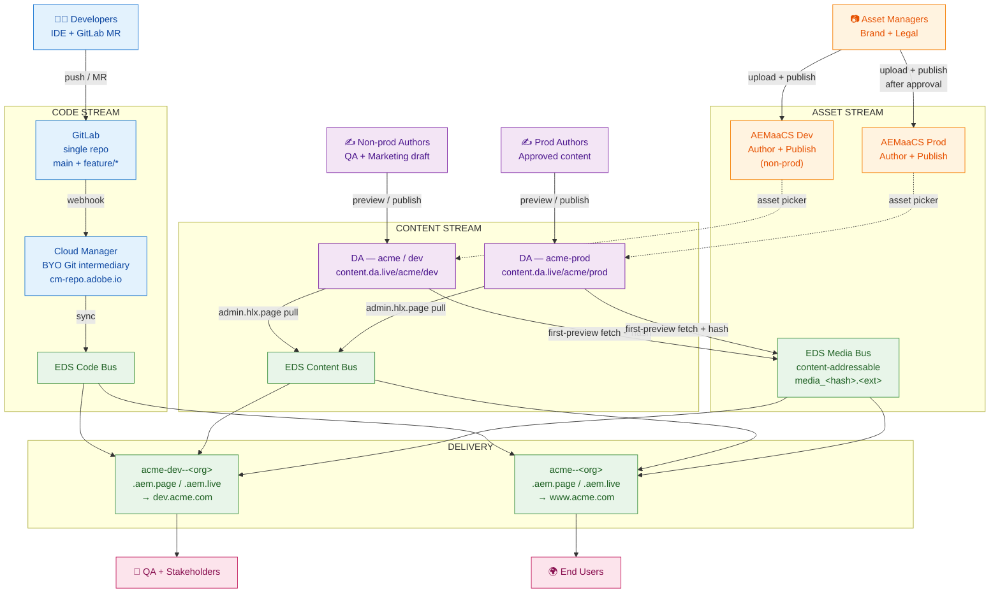
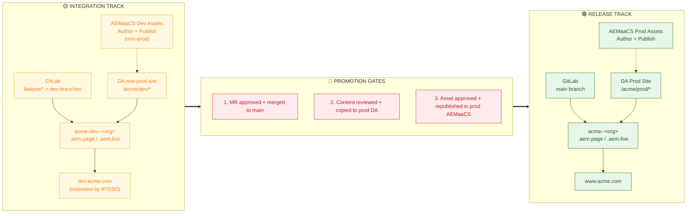
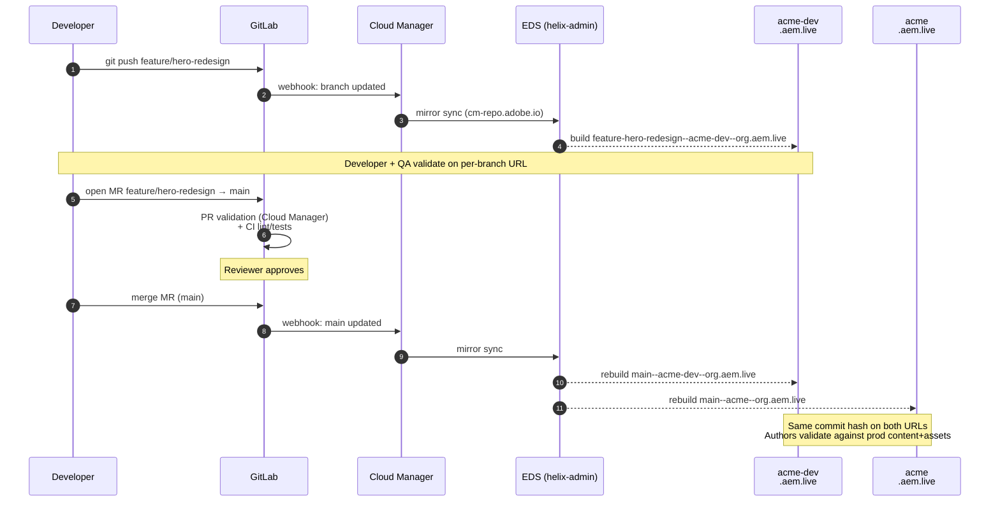

# AEM Edge Delivery — Multi-Environment Summary

**Purpose:** High-level view of environments, who uses them, how code/content/assets fit together, and how releases flow.

---

## 1. Two tracks at a glance

EDS separates **code** (branch-per-environment), **content** (Document Authoring stores), and **assets** (AEM as a Cloud Service). Content and assets are not branchable like Git, so isolation uses **two parallel tracks** — non-production integration vs production — each with its own DA site and AEM Assets program.

| Track | Role | Code | Content (DA) | Assets (AEMaaCS) | Typical public face |
|--------|------|------|----------------|--------------------|----------------------|
| **Integration** | Build, draft, QA, stakeholder review | Feature & `dev` branches → per-branch `*.aem.page` / `*.aem.live` on the integration EDS site (e.g. **`acme-dev`**) | Non‑prod DA org/site (e.g. `acme-dev` or `acme/dev`) | **AEMaaCS Dev** (non‑prod DAM — not the AEMaaCS Stage runtime) | `dev.acme.com` → `main--acme-dev--<org>.aem.live` |
| **Release** | Live production | Protected **`main`** → prod EDS site + custom domain | Prod org/site (e.g. `acme`) | Production program | `www.acme.com` → `main--acme--<org>.aem.live` |

**Single GitLab repo, two EDS sites:** One repository registered once in Cloud Manager (BYO Git) drives both `acme-dev` and `acme`, so the same commit on `main` is identical on both tracks — no merge drift between integration‑track delivery and production delivery.

---

## 2. Environments and intended users

**Code (every Git branch is an environment)**  
EDS builds preview and live URLs per branch, e.g. `https://<branch>--<repo>--<owner>.aem.page` (low cache, fast iteration) and `https://<branch>--<repo>--<owner>.aem.live` (production-like caching). Validate features on **`.aem.live`**, not only `.aem.page`.

| Surface | Primary users | What they do |
|---------|----------------|--------------|
| Per-branch **`.aem.page`** (integration EDS site, e.g. `acme-dev`) | Developers | Quick smoke tests, author feedback |
| Per-branch **`.aem.live`** (integration EDS site) | Developers, QA | Performance and cache behavior like prod |
| **`dev.acme.com`** (maps to `main` on integration EDS site) | QA, marketing, legal/brand, stakeholders | End-to-end UAT on `main` + non‑prod DA content + **AEMaaCS Dev** assets; often IP/SSO restricted |
| **`www.acme.com`** (maps to `main` on prod EDS site) | Customers, SEO, analytics | Live site |

**Document Authoring (DA)**  
| DA area | Primary users | Intent |
|---------|----------------|--------|
| Non‑prod DA site | Authors drafting, content QA, marketing | Drafts, preview against **AEMaaCS Dev** DAM |
| Prod site | Small publisher group, localization leads | Publish after review; content promoted from non‑prod DA when ready |

**AEM Assets**  
| Environment | Primary users | Intent |
|-------------|----------------|--------|
| **AEMaaCS Dev** (non‑prod program) | Asset managers, brand/legal, photographers | Ingest, metadata, renditions, rights review — **not** production DAM |
| Prod | DAM admins, approved publishers | Final assets published to publish tier for production pages |

---

## 3. Architecture (high level)

The following explains how each of the three streams is independently managed before converging at the EDS delivery layer

Three **independent buses** converge at Edge Delivery:

| Bus | Source of truth | How it moves |
|-----|------------------|--------------|
| **Code** | GitLab (via Cloud Manager BYO Git → EDS Code Bus) | Every push/MR updates branch URLs; `main` updates both EDS sites that reference the repo |
| **Content** | DA (`content.da.live`) per org/site | Preview/publish pulls into Content Bus; orthogonal to which code branch you hit (change URL prefix to test code vs content combinations) |
| **Media** | Assets referenced from documents | On first preview, EDS fetches from AEM Publish, hashes binary, serves from **Media Bus** (`media_<hash>.*`) — CDN-friendly, immutable per hash |

**Why two DA sites and two AEM programs:** DA documents and DAM assets are not Git branches. Separate non‑prod vs prod stores prevent draft or unapproved assets from appearing on production previews. On the integration track, AEM Assets are sourced from **AEMaaCS Dev**, not from an AEMaaCS **Stage** environment.

**Public hostnames** typically proxy **`.aem.live`** (not `.aem.page`) so behavior matches cached production delivery.

### Architecture diagrams

#### High-Level Architecture — All three streams converging on EDS

#### Two-Track Topology — Side-by-Side

#### Branching & Release Workflow (Code)

#### Asset Delivery Flow (no Dynamic Media)

```mermaid
flowchart LR
    classDef src fill:#fff3e0,stroke:#e65100
    classDef proc fill:#e8eaf6,stroke:#1a237e
    classDef edge fill:#e8f5e9,stroke:#1b5e20
    classDef user fill:#fce4ec,stroke:#880e4f

    UP["Asset uploaded to<br/>AEMaaCS Author<br/>/content/dam/hero.jpg"]:::src
    PUB["Replicated to<br/>AEMaaCS Publish<br/>(must be published)"]:::src
    DA["Author selects asset<br/>via DA Assets browser<br/>→ inserts publish URL"]:::proc
    PREV["Author clicks Preview<br/>in DA"]:::proc
    FETCH["EDS fetches asset<br/>from AEMaaCS Publish<br/>(one-time, per hash)"]:::proc
    HASH["EDS hashes binary<br/>→ media_a3f9...c2.jpg"]:::proc
    MB["Stored in<br/>EDS Media Bus<br/>(immutable per hash)"]:::edge
    REWRITE["Document HTML<br/>references rewritten<br/>to media_*.jpg"]:::proc
    CDN["CDN edge<br/>(Adobe Managed or BYO)<br/>+ on-the-fly<br/>AVIF/WebP/resize"]:::edge
    BR["Browser receives<br/>WebP/AVIF<br/>at correct DPR & width"]:::user

    UP --> PUB
    PUB --> DA
    DA --> PREV
    PREV --> FETCH
    FETCH --> HASH
    HASH --> MB
    MB --> REWRITE
    REWRITE --> CDN
    CDN --> BR

    style FETCH stroke-dasharray: 5 5
```

> **Key insight:** AEMaaCS Publish is hit **only once per asset hash**. Once cached in Media Bus, the asset is served from the EDS edge for every subsequent request. AEMaaCS is the *origin of authority*, not the *origin of delivery*.

---

## 4. Branching and release strategy

### Branch model

- **Trunk-based:** short-lived **`feature/*`** (and **`hotfix/*`** when needed) merge to **`main`**.  
- **`main`** is protected: no direct push; MR approval + CI (e.g. Cloud Manager PR validation) required.  
- Avoid a long-lived **`staging`** branch mapping to a separate CDN site — EDS is optimized for **branch-per-feature**, not a duplicate staging line.

### Code flow (simplified)

1. Push **`feature/x`** → automatic **`feature-x--acme-dev--<org>.aem.live`** (and `.aem.page`).  
2. Open MR → **`feature/x` → `main`**, review, QA on branch URL against **non‑prod** DA + **AEMaaCS Dev** DAM.  
3. Merge to **`main`** → Cloud Manager sync → **`main--acme-dev--<org>.aem.live`** and **`main--acme--<org>.aem.live`** both rebuild **same commit**.  
4. UAT on **`dev.acme.com`**; when satisfied, coordinate **content** (copy/republish to prod DA) and **assets** (promote/republish in prod AEM — not automatic across programs).  
5. Live traffic on **`www.acme.com`** reads **`main`** on the prod EDS site + prod DA + prod DAM.

### Gates (ownership in brief)

| Gate | Typical owner | Notes |
|------|----------------|--------|
| Branch builds clean | Developer | Lint/tests; branch URL works |
| Merge to `main` | Tech lead + passing checks | MR + Cloud Manager validation |
| Ship code to production experience | Release manager | UAT on integration hostname (`dev.acme.com`); no blocking sev-1 |
| Content on prod DA | Content lead / release | Editorial + legal; references resolve |
| Assets on prod AEM | DAM admin | Rights and metadata; republish |
| Cache / invalidation on go-live | Release manager | Align all three streams on prod track |

### Hotfix

Branch **`hotfix/<ticket>` from `main`**, push → validate on integration track branch URL → expedited MR → merge **`main`** → both tracks update. The integration track still tracks `main`; release manager may push to prod quickly for critical fixes.

---

## 5. One-line mental model

**Integration track** = experiment safely (any branch + non‑prod DA + **AEMaaCS Dev** DAM + `dev.acme.com` for `main`). **Release track** = **`main`** + prod DA + prod DAM + **`www.acme.com`**. **Promotion** is a merge for code, and deliberate human/process steps for content and assets.
