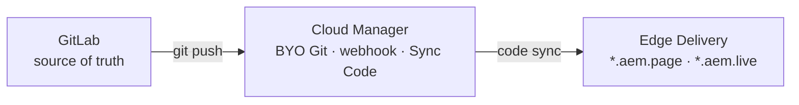
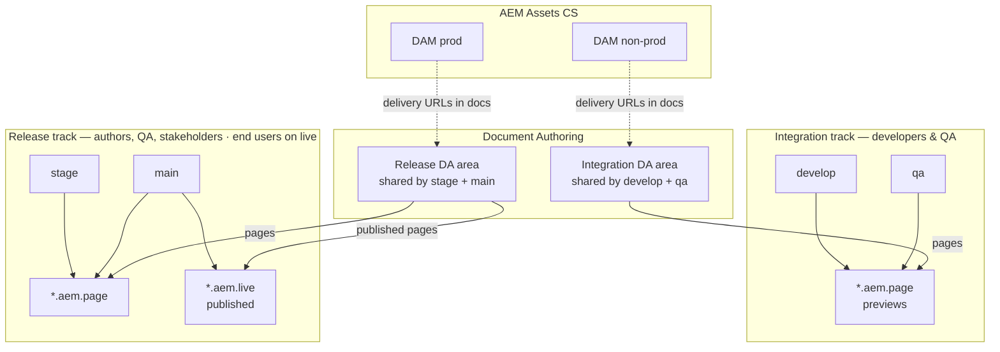

# Multi-environment setup (simplified): two DAMs, two DA content tracks, four EDS entry points

This model keeps **integration work** (developers + QA) on **one Document Authoring (DA) content space and one non-production DAM**, and **release work** (staging + production) on **a second DA content space and one production DAM**.

Code is delivered with **GitLab** as the system of record and **Adobe Cloud Manager** as the bridge to Edge Delivery (**Bring Your Own Git**), not the public GitHub–only **AEM Code Sync** app. See [Bring your own git](https://www.aem.live/developer/byo-git).

It still follows Edge Delivery ideas from [Staging & Environments](https://www.aem.live/docs/staging) and the [Developer Tutorial](https://www.aem.live/developer/tutorial).

## Summary

| Track | Who | Edge Delivery (code) | Content (DA) | Assets (DAM) |
|--------|-----|----------------------|--------------|--------------|
| **Integration** | Developers, QA (internal) | `develop` and `qa` Git branches → preview URLs on `*.aem.page` | **One** DA area used by both (same docs/paths) | **DAM non-prod** (e.g. AEM CS Dev / non-prod program) |
| **Release** | Marketing authors, QA sign-off, executives, **end users** (external on live) | `stage` branch → preview; `main` → preview + **`*.aem.live`** | **One** DA area used by both stage and prod (same docs/paths) | **DAM prod** |

- **Preview vs publish:** Stage and production **share the same DA documents**; **staging** is still a **code** preview on `stage--…--.aem.page`, while **production** is **published** content on `…--.aem.live` (see [staging doc](https://www.aem.live/docs/staging) — `*.aem.page` is not a full stand-in for production caching).
- **Two DAMs:** All image/file URLs embedded in **integration** DA pages must point at **non-prod** delivery. All URLs in **release** DA pages must point at **prod** DAM delivery (Dynamic Media or AEM publish URLs, per your setup).

## Who uses what

| Audience | Integration track | Release track | Internal / external |
|----------|-------------------|---------------|---------------------|
| Developers | `localhost`, `develop--…`, `qa--…`, integration DA, DAM non-prod | Sometimes `stage--…` for joint reviews | Internal |
| QA | Same EDS previews + integration DA + DAM non-prod | `stage--…` + release DA + DAM prod for final checks; `main--…` / `*.aem.live` for go-live validation | Internal |
| Marketing / authors | Optional scratch content in integration | Primary authoring in **release** DA; publish when ready for live | Internal |
| Executives / stakeholders | Rare | `stage--…` and `*.aem.live` for approvals | Internal / external |
| Site visitors | No | **`*.aem.live`** only | External |

## Architecture overview

### Code path (GitLab → Edge Delivery)

### Content, assets, and branches

Solid arrows show **primary flow** (code path above, or DA-driven pages to Edge Delivery). Dotted arrows mean **authors embed DAM delivery URLs** in DA; assets are not streamed through DA servers at runtime.

## Prerequisites

- **GitLab** repository (cloud or self-hosted — both are supported for BYO Git per [Bring your own git](https://www.aem.live/developer/byo-git)) containing your Edge Delivery codebase. You can seed it from the [AEM boilerplate](https://github.com/adobe/aem-boilerplate) by importing or mirroring that template into GitLab; Edge Delivery expects a **`main`** branch for production code.
- **Cloud Manager** access to onboard the external GitLab repo (webhook, sync) and to connect it to your Edge Delivery site — full sequence is in **Setup step 3** below.
- **`aem.live` org:** Even when GitLab hosts your code, Adobe requires that your **`aem.live` organization name still exists as a GitHub.com org you control (namespace reservation). Your GitLab remote remains separate — see [Bring your own git — Prepare your Edge Delivery Services Site](https://www.aem.live/developer/byo-git).
- Document Authoring access on [da.live](https://da.live/) ([docs](https://docs.da.live/)).
- AEM as a Cloud Service with **two separate Assets-capable environments** (for example a **non-production** program/environment and **production**), each with delivery URLs documented — see [AEM Assets overview](https://experienceleague.adobe.com/en/docs/experience-manager-cloud-service/content/assets/overview).

---

## Setup steps

### 1. Create the two DAM environments in AEM Cloud Service

1. In Cloud Manager / your Adobe programs, ensure you have **two** Assets environments you can use as **DAM non-prod** and **DAM prod** (naming is up to you; often “Development” + “Production”).
2. For each environment, note:
   - **Author** URL (for asset upload and workflow).
   - **Publish / delivery** base URL(s) authors will paste into DA (e.g. Dynamic Media or dispatcher-style asset URLs).
3. Configure **users and groups** so only integration authors use non-prod DAM for day-to-day experiments, and only trained authors publish assets for the live site on **DAM prod** (or use your central DAM governance process).

### 2. Create two content areas in Document Authoring

Goal: **integration** authors never mix prod asset URLs into the wrong tree, and **release** authors own what stage and prod show.

1. In DA, create **two separate roots** you will keep distinct:
   - **Integration** — all pages and experiments for dev/QA (shared by `develop` and `qa` EDS previews).
   - **Release** — all pages that **stage** and **production** will render (shared by `stage` and `main`).
2. Exact mechanics depend on your DA setup (separate sites vs top-level folders). Name them clearly, e.g. `integration` and `www` (or `release`).
3. Set **permissions** so most marketing work happens under **Release**; give developers and QA write access to **Integration** as needed.

### 3. Connect GitLab to Edge Delivery (Bring Your Own Git via Cloud Manager)

Follow the official flow in [Bring your own git](https://www.aem.live/developer/byo-git). Below is the **order of operations** for this customer (GitLab + Cloud Manager); use Adobe’s page for exact Admin API payloads and screenshots.

1. **Prepare the Edge Delivery site** — Have an `aem.live` site registered in the configuration service with an **admin** user. If the site was created only via one-click Cloud Manager without admin on the org, some Admin API steps may be blocked; align with Adobe support or use the path that grants your team admin on the org ([tutorial](https://www.aem.live/developer/tutorial) pattern).
2. **Onboard GitLab in Cloud Manager** — Add your **GitLab** repository as an external repository. Complete ownership verification until status is **READY**. Configure the **webhook** in GitLab using the URL, API key, and **webhook secret** from Cloud Manager so pushes notify Cloud Manager ([Configure your External Repository](https://www.aem.live/developer/byo-git)).
3. **Link the Edge Delivery site to that repository** — In Cloud Manager, open your Edge Delivery site and choose **Bring Your Own Git**. Select the GitLab repository. Copy the **secret** Cloud Manager shows (store it securely; it may not be shown again).
4. **Configure the site to use Cloud Manager as code source** — Use the **Admin API** to POST `code.json` with `"type": "byogit"` and the `cm-repo.adobe.io` `url` / `raw_url`, plus Cloud Manager **program** and **repository** identifiers from the “Configure Webhook” section. Create the **`cm-byog`** secret via the Admin API with the value from the previous step ([Configure your AEM Site to use Cloud Manager](https://www.aem.live/developer/byo-git)).
5. **Run the first sync** — In Cloud Manager, use **Sync Code** on the site, choose the branch (e.g. `main`). Poll job status with the Admin API if needed.
6. **Verify** — Open `https://main--<site>--<org>.aem.page` and confirm GitLab `main` is reflected. Ongoing pushes sync **asynchronously**; use hard refresh or a private window when testing ([Verify your AEM Site](https://www.aem.live/developer/byo-git)).

**Repoless / multiple sites:** If you later reuse the **same** GitLab repo for a **second** Edge Delivery site, Adobe documents a **repoless** `code.json` variant without duplicating the `cm-byog` secret — see [Repoless - One codebase, many sites](https://www.aem.live/developer/byo-git).

**Troubleshooting:** Stale code after push usually means webhook or secret misconfiguration — see [Troubleshooting](https://www.aem.live/developer/byo-git) on the same page.

### 4. Wire the GitLab-backed site to DA (Helix / fstab)

1. In your **GitLab** repo, configure the content mapping (typically `fstab.yaml` / project config) so the **Edge Delivery project** can read from your DA root that contains **both** `integration` and `release` areas (or follow your Adobe solution engineer’s pattern for two mounts if you use two DA projects).
2. Confirm in the [DA developer docs](https://docs.da.live/) that the **site** is bound to the correct **Edge Delivery** site/org in the configuration service (code now comes from GitLab via Cloud Manager, not the GitHub Code Sync app).
3. **Path rule of thumb:** URLs under `/integration/...` are only for the integration track; `/www/...` (or your release folder) is what stage and prod use. Adjust names to match your `fstab` mount path.

### 5. Git branches and audiences

1. Create long-lived branches in **GitLab** (names can vary):

   - `develop` — developer integration; preview: `https://develop--<site>--<org>.aem.page/`
   - `qa` — QA regression on integration content + DAM non-prod; preview: `https://qa--<site>--<org>.aem.page/`
   - `stage` — release candidate **code** against **release** DA + **DAM prod**; preview: `https://stage--<site>--<org>.aem.page/`
   - `main` — production **code**; live: `https://<site>--<org>.aem.live/` and preview: `https://main--<site>--<org>.aem.page/`

   Use your actual **site** and **org** slugs from the Edge Delivery URL pattern (they may differ from GitLab project name).

2. Protect `main` and `stage` in **GitLab**: use [protected branches](https://docs.gitlab.com/ee/user/project/protected_branches.html) and merge request approvals so changes require review before merge.

3. **Merge flow (example):** `develop` → `qa` → `stage` → `main`. Feature branches still get their own `https://<branch>--…aem.page/` previews per [staging guidance](https://www.aem.live/docs/staging). After each push, rely on **Cloud Manager / Edge Delivery** code sync (not a GitHub app).

### 6. Pin content + assets per track

1. **Integration DA:** Authors and developers link images and downloads using **only DAM non-prod** delivery URLs.
2. **Release DA:** Authors use **only DAM prod** delivery URLs.
3. Optionally maintain a short **cheat sheet** (internal wiki) listing the two base URLs so paste mistakes are rare.

### 7. Install Sidekick and train authors

1. Install the [AEM Sidekick](https://chromewebstore.google.com/detail/aem-sidekick/igkmdomcgoebiipaifhmpfjhbjccggml) extension ([tutorial](https://www.aem.live/developer/tutorial)).
2. Train authors:
   - **Preview** on `*.aem.page` vs **publish** that affects `*.aem.live`.
   - Which DA folder is **integration** vs **release**.
   - Which DAM base URL belongs to which folder.

### 8. QA checklist before production

1. With **`stage` branch** preview (synced from GitLab), walk critical paths using **release** DA documents and **prod** DAM assets.
2. After code merge to **`main`**, repeat smoke tests on `main--…aem.page` and then **`*.aem.live`** after content is **published** from DA.

### 9. Local development

1. Clone from **GitLab** (`git clone <your-gitlab-url>`). Install `@adobe/aem-cli` and run `aem up` for `http://localhost:3000/` ([tutorial](https://www.aem.live/developer/tutorial)).
2. Developers typically point local preview at **integration** paths and **DAM non-prod** links to avoid touching production assets.

---

## Optional: staging CDN hostname

If you must test **customer CDN** rules (rewrites, WAF, edge logic), add a **staging hostname** that mirrors production URL patterns and uses **`*.aem.live`** as origin — see [When you should set up a staging environment](https://www.aem.live/docs/staging). This is separate from the four-branch model above.

## References

- [Bring your own git (GitLab, Bitbucket, Azure DevOps, GHE via Cloud Manager)](https://www.aem.live/developer/byo-git)
- [Staging & Environments](https://www.aem.live/docs/staging)
- [Developer Tutorial](https://www.aem.live/developer/tutorial)
- [Document Authoring docs](https://docs.da.live/)
- [Authoring sources overview](https://www.aem.live/docs/authoring-guide)
- [AEM Assets as a Cloud Service – overview](https://experienceleague.adobe.com/en/docs/experience-manager-cloud-service/content/assets/overview)
